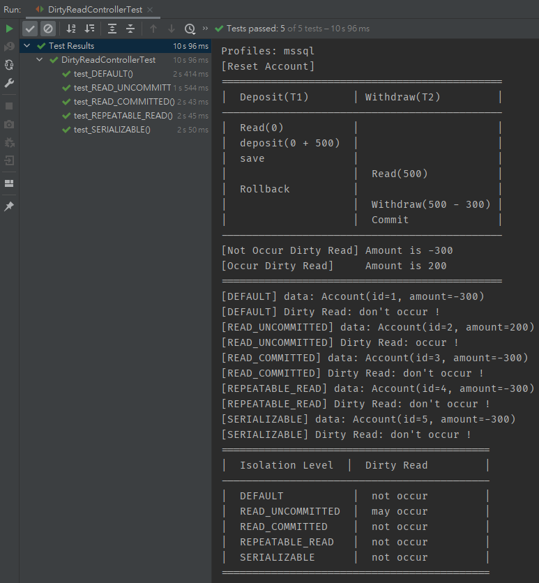

# Simulate Transaction Isolation Level

## Environment
- Win10
- IntelliJ IDEA 2020.3 (Ultimate Edition)
- Gradle 6.8.3
- Java 8
- Spring Boot 2.3.10.RELEASE

## Simulate Concurrent Transaction

### Switch Database Testing
```yaml
spring:
  profiles:
    # dev h2 mssql mysql postgresql
    active: h2
```

### Use the JUnit 5 to test




## Database Testing Result

### H2

Isolation Level `DEFAULT` seems is equal `READ_COMMITTED`.

| Isolation Level | Dirty Read | Unrepeatable Read | Phantom Read | Lost Update | Write Skew |
| --------------- | ---------- | ----------------- | ------------ | ----------- | ---------- |
| DEFAULT         | not occur  | may occur         | may occur    | may occur   | ?          |
| READ_UNCOMMITTED| may occur  | may occur         | may occur    | may occur   | ?          |
| READ_COMMITTED  | not occur  | may occur         | may occur    | may occur   | ?          |
| REPEATABLE_READ | not occur  | not occur         | not occur    | may occur   | ?          |
| SERIALIZABLE    | not occur  | not occur         | not occur    | may occur   | ?          |

### MS SQL

Version: Microsoft SQL Server 2019 (RTM-CU10) (KB5001090) - 15.0.4123.1 (X64)

Isolation Level `DEFAULT` seems is equal `READ_COMMITTED`.

`REPEATABLE_READ`、`SERIALIZABLE` in Isolation Level `Lost Update` need `@Retryable` to retry otherwise will throw `CannotAcquireLockException`.


| Isolation Level  | Dirty Read | Unrepeatable Read | Phantom Read | Lost Update | Write Skew |
| ---------------- | ---------- | ----------------- | ------------ | ----------- | ---------- |
| DEFAULT          | not occur  | may occur         | may occur    | may occur   | ?          |
| READ_UNCOMMITTED | may occur  | may occur         | may occur    | may occur   | ?          |
| READ_COMMITTED   | not occur  | may occur         | may occur    | may occur   | ?          |
| REPEATABLE_READ  | not occur  | not occur         | may occur    | not occur   | ?          |
| SERIALIZABLE     | not occur  | not occur         | not occur    | not occur   | ?          |

### MySQL

Version: MySQL 5.7 InnoDB

Isolation Level `DEFAULT` seems is equal `REPEATABLE_READ`.

`SERIALIZABLE` in Isolation Level `Lost Update` need `@Retryable` to retry otherwise will throw `CannotAcquireLockException`.

| Isolation Level  | Dirty Read | Unrepeatable Read | Phantom Read | Lost Update | Write Skew |
| ---------------- | ---------- | ----------------- | ------------ | ----------- | ---------- |
| DEFAULT          | not occur  | not occur         | may occur    | may occur   | ?          |
| READ_UNCOMMITTED | may occur  | may occur         | may occur    | may occur   | ?          |
| READ_COMMITTED   | not occur  | may occur         | may occur    | may occur   | ?          |
| REPEATABLE_READ  | not occur  | not occur         | may occur    | may occur   | ?          |
| SERIALIZABLE     | not occur  | not occur         | not occur    | not occur   | ?          |

### PostgreSQL 

Version: PostgreSQL 13.2

Isolation Level `DEFAULT` seems is equal `READ_COMMITTED`.

`REPEATABLE_READ`、`SERIALIZABLE` in Isolation Level `Lost Update` need `@Retryable` to retry otherwise will throw `CannotAcquireLockException`.

| Isolation Level  | Dirty Read | Unrepeatable Read | Phantom Read | Lost Update | Write Skew |
| ---------------- | ---------- | ----------------- | ------------ | ----------- | ---------- |
| DEFAULT          | not occur  | may occur         | may occur    | may occur   | ?          |
| READ_UNCOMMITTED | not occur  | may occur         | may occur    | may occur   | ?          |
| READ_COMMITTED   | not occur  | may occur         | may occur    | may occur   | ?          |
| REPEATABLE_READ  | not occur  | not occur         | not occur    | not occur   | ?          |
| SERIALIZABLE     | not occur  | not occur         | not occur    | not occur   | ?          |


## Reference
- https://medium.com/@chester.yw.chu/%E5%B0%8D%E6%96%BC-mysql-repeatable-read-isolation-%E5%B8%B8%E8%A6%8B%E7%9A%84%E4%B8%89%E5%80%8B%E8%AA%A4%E8%A7%A3-7a9afbac65af
- https://www.baeldung.com/spring-transactional-propagation-isolation
- https://openhome.cc/Gossip/HibernateGossip/IsolationLevel.html