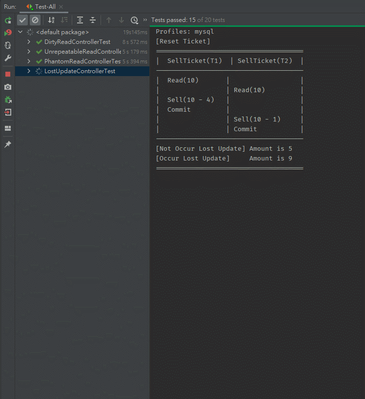

# Simulate Transaction Isolation Level

## Environment
- Win10
- IntelliJ IDEA 2020.3 (Ultimate Edition)
- Gradle 6.8.3
- Java 8
- Spring Boot 2.3.10.RELEASE

## Simulate Concurrent Transaction

###  Database Setting

Go to [here](src/main/resources/config/database-setting.properties) to change your testing database type and  you can custom your database ip or port.
```properties
# Database Type(h2 mysql postgresql sqlite sqlserver)
database-type=h2

# Change to your custom mysql ip or port
mysql-ip=localhost
mysql-port=3306

# Change to your custom postgresql ip or port
postgresql-ip=localhost
postgresql-port=5432

# Change to your custom sqlserver ip or port
sqlserver-ip=localhost
sqlserver-port=4033
```

### Use the JUnit 5 to test




## Database Testing Result

### H2

| Isolation Level | Dirty Read | Unrepeatable Read | Phantom Read | Lost Update |
| --------------- | ---------- | ----------------- | ------------ | ----------- |
| DEFAULT         | not occur  | may occur         | may occur    | may occur   |
| READ_UNCOMMITTED| may occur  | may occur         | may occur    | may occur   |
| READ_COMMITTED  | not occur  | may occur         | may occur    | may occur   |
| REPEATABLE_READ | not occur  | not occur         | not occur    | may occur   |
| SERIALIZABLE    | not occur  | not occur         | not occur    | may occur   |

> - Isolation Level `DEFAULT` seems to be equal to `READ_COMMITTED`.

---

### MySQL

Version: **MySQL 5.7 InnoDB**

| Isolation Level  | Dirty Read | Unrepeatable Read | Phantom Read | Lost Update |
| ---------------- | ---------- | ----------------- | ------------ | ----------- |
| DEFAULT          | not occur  | not occur         | may occur    | may occur   |
| READ_UNCOMMITTED | may occur  | may occur         | may occur    | may occur   |
| READ_COMMITTED   | not occur  | may occur         | may occur    | may occur   |
| REPEATABLE_READ  | not occur  | not occur         | may occur    | may occur   |
| SERIALIZABLE     | not occur  | not occur         | not occur    | not occur   |

> - Isolation Level `DEFAULT` seems to be equal to `REPEATABLE_READ`.
> - In the `Lost Update` problem, the `SERIALIZABLE` in Isolation Level must be retried with `@Retryable`; otherwise, it will throw `LockAcquisitionException`.

---

### PostgreSQL 

Version: **PostgreSQL 13.2**

| Isolation Level  | Dirty Read | Unrepeatable Read | Phantom Read | Lost Update |
| ---------------- | ---------- | ----------------- | ------------ | ----------- |
| DEFAULT          | not occur  | may occur         | may occur    | may occur   |
| READ_UNCOMMITTED | not occur  | may occur         | may occur    | may occur   |
| READ_COMMITTED   | not occur  | may occur         | may occur    | may occur   |
| REPEATABLE_READ  | not occur  | not occur         | not occur    | not occur   |
| SERIALIZABLE     | not occur  | not occur         | not occur    | not occur   |

> - Isolation Level `DEFAULT` seems to be equal to `READ_COMMITTED`.
> - In the `Lost Update` problem, the `REPEATABLE_READ`、`SERIALIZABLE` in Isolation Level must be retried with `@Retryable`; otherwise, it will throw `LockAcquisitionException`

---

### SQLite 

| Isolation Level  | Dirty Read | Unrepeatable Read | Phantom Read | Lost Update |
| ---------------- | ---------- | ----------------- | ------------ | ----------- |
| DEFAULT          | not occur  | not occur         | not occur    | not occur   |
| READ_UNCOMMITTED | not occur  | not occur         | not occur    | not occur   |
| SERIALIZABLE     | not occur  | not occur         | not occur    | not occur   |

> - SQLite supports only `TRANSACTION_SERIALIZABLE` and `TRANSACTION_READ_UNCOMMITTED`.
> - SQLite does not support concurrent writing, so you need to perform lock contention or retry writing.

---

### SQL Server

Version: **Microsoft SQL Server 2019 (RTM-CU10) (KB5001090) - 15.0.4123.1 (X64)**

| Isolation Level  | Dirty Read | Unrepeatable Read | Phantom Read | Lost Update |
| ---------------- | ---------- | ----------------- | ------------ | ----------- |
| DEFAULT          | not occur  | may occur         | may occur    | may occur   |
| READ_UNCOMMITTED | may occur  | may occur         | may occur    | may occur   |
| READ_COMMITTED   | not occur  | may occur         | may occur    | may occur   |
| REPEATABLE_READ  | not occur  | not occur         | may occur    | not occur   |
| SERIALIZABLE     | not occur  | not occur         | not occur    | not occur   |

> - Isolation Level `DEFAULT` seems to be equal to `READ_COMMITTED`.
> -  In the `Lost Update` problem, the `REPEATABLE_READ`、`SERIALIZABLE` in Isolation Level must be retried with `@Retryable`; otherwise, it will throw `LockAcquisitionException`.

---

## Reference
- https://medium.com/@chester.yw.chu/%E5%B0%8D%E6%96%BC-mysql-repeatable-read-isolation-%E5%B8%B8%E8%A6%8B%E7%9A%84%E4%B8%89%E5%80%8B%E8%AA%A4%E8%A7%A3-7a9afbac65af
- https://www.baeldung.com/spring-transactional-propagation-isolation
- https://openhome.cc/Gossip/HibernateGossip/IsolationLevel.html